

简单的介绍ShadowsocksR是什么及如何自己购买并搭建ShadowsocksR需要的服务器。



<!--more-->

## ShadowsocksR 概述

`ShadowsocksR`（下简称`SSR`）的前身`ShadowSocks`（下简称`SS`）,是被设计用来混淆数据，用来瞒过墙的实时流量检测，其作者在15年8月被有关部门约谈后，删除了Github上的源码及文档[^1]。

`SSR`则是在`SS`作者停止项目更新后，由另一个作者制作的第三方的版本，加强了混淆协议和插件版本。`SS`和`SSR`的工作逻辑并不是加密数据，而是通过伪装来增加`GFW`(The Great Firewall of China)识别的难度。

> "We don't need security. We need indistinguishability from random bytes."[^2]

`SS`只有一种混淆方式且用户无法自行选择，在作者放弃项目后，这个混淆方式逐渐被墙所识别，所以现阶段`SS`几乎已经无法正常使用。

## 搭建SSR翻墙

搭建`SSR`的基本流程为：
1. 购买国外服务器
2. 在国外服务器上安装`SSR软件`（作为Server）
3. 安装`SSR客户端`，并访问国外服务器（作为Client）

市面上有很多售卖翻墙服务的，他们大部分都是自己完成了上述的1,2步骤，然后将配置好的服务器地址售卖给用户，让用户自己使用SSR客户端进行翻墙。这样服务的弊端首先在于服务器的共享会限制网速，其次由于大量的IP访问同一台服务器，增加了被`GFW`识别的概率，服务器也容易被Ban，导致服务的不稳定性。

### 购买服务器

服务器可在[Bandwagon](https://bwh88.net/vps-hosting.php)（下简称搬瓦工）上进行购买，最便宜的套餐为50美元一年，支持支付宝支付。

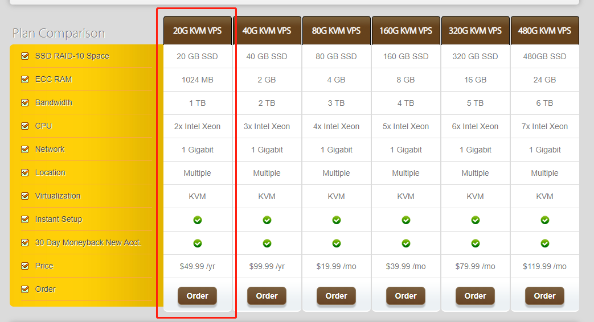

在购买的过程中，会需要你进行注册，用邮箱即可。

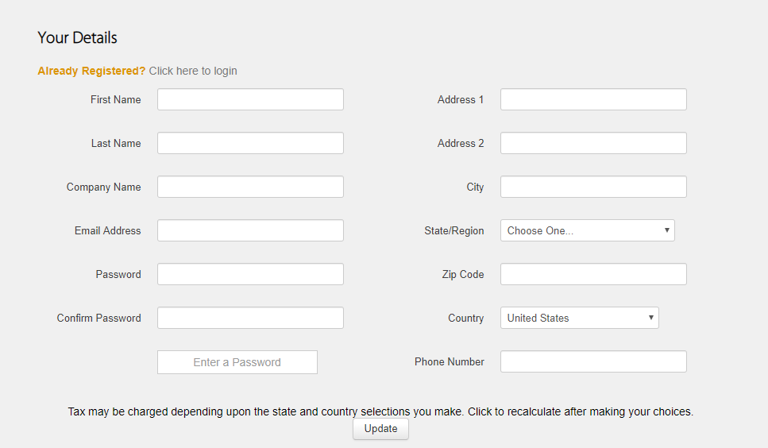

### 配置服务器

购买完成后，点击搬瓦工页面上方的，`ClientArea`按钮，进入个人管理，并依次点击Services->MyServices->KiwiVM Control Panel，进入管理面板。

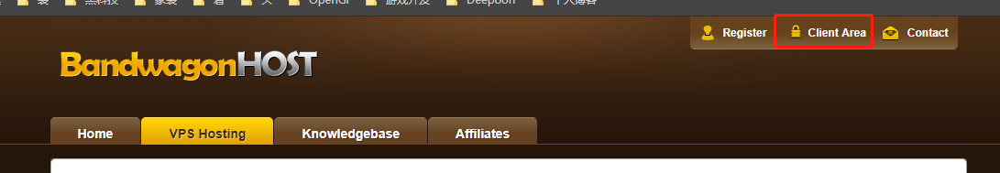

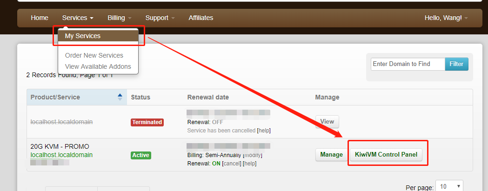

进入管理面板后，先点击`Stop`，将当前服务禁止。注意在这个界面也显示了服务器的地址，记录下这个地址，之后需要用到。

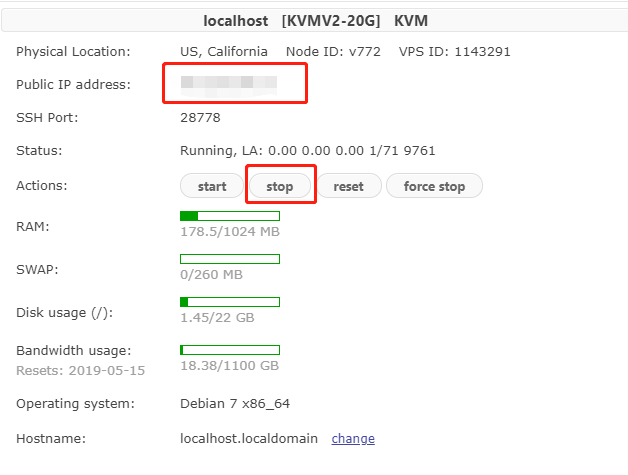

点击左侧`Install new OS`安装新的操作系统，选择`ubuntu 12.04 X86_04`，同意款项，并安装。

> 如果需要BBR加速的话，建议选择最高的X64版本，因为BBR依赖于4.9以上的Linux内核


严格意义上，SSR服务端安装脚本并不依赖于特定系统版本，CentOS 6+，Debian 7+，Ubuntu 12+的系统均可。如果在某版本的系统上出现安装错误（如2019年4月前后，Debian服务器访问失效，导致对应依赖库无法安装），可尝试使用其他版本的系统。


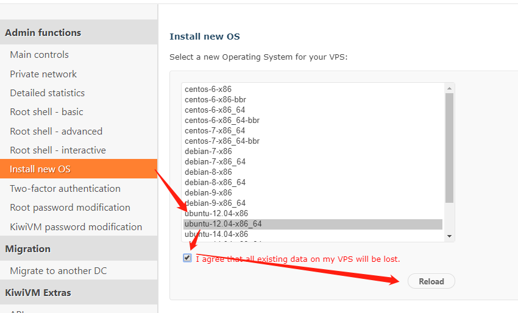

在OS安装后，会显示处`SSH`的登录密码及端口，通过截图或者其他方法将它们保存下来，之后的步骤需要用到。通常情况下，搬瓦工也会发送一封邮件到你的注册邮箱告诉你密码及端口。

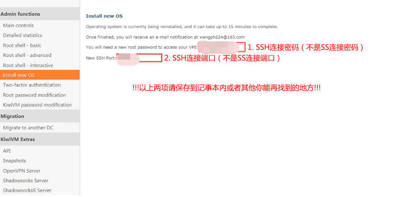
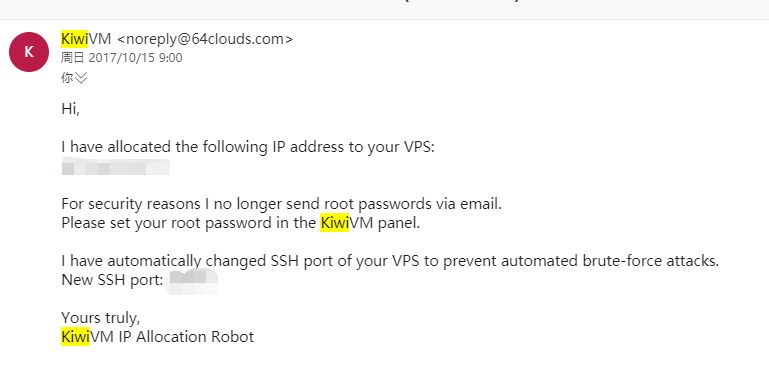

### 安装SSR软件

在服务器上安装SSR软件，首先你需要登录到服务器上，一般使用软件[Xshell](https://www.netsarang.com/zh/xshell/)，该软件不是免费的，但有一个月的试用期。

在安装完并打开`Xshell`后，会自动弹出会话窗口，点击右上角新建，然后将我们在之前步骤中记录下的服务器地址及SSH端口号填入。

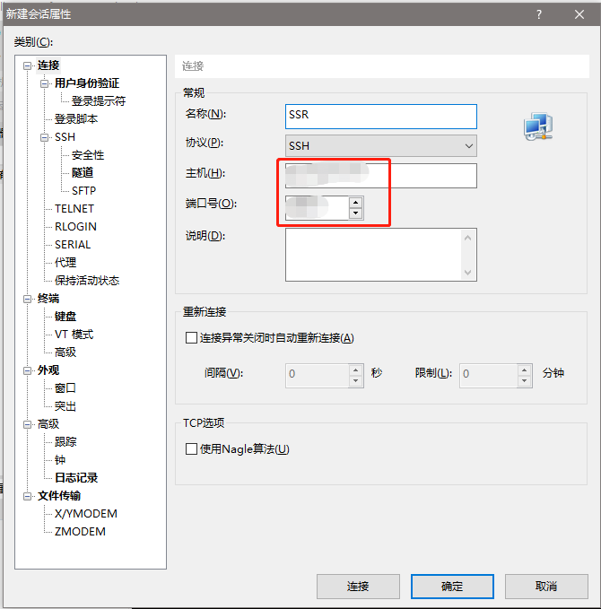

点击确认后，会自动回到会话窗口，双击刚刚建立的会话，输入用户名`root`，在连接过程中会提示`SSH安全警告`，点击`接受并保持`即可，之后会弹出`SSH用户省份验证`窗口，将之前记录下的密码填入即可。

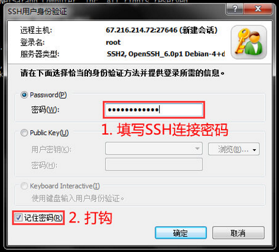

成功登录后，界面如下。

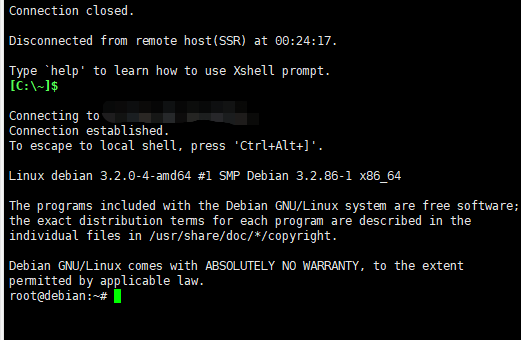

之后我们就要进行SSR软件安装，复制命令

```text
wget --no-check-certificate -O shadowsocks-all.sh https://raw.githubusercontent.com/teddysun/shadowsocks_install/master/shadowsocks-all.sh
chmod +x shadowsocks-all.sh
./shadowsocks-all.sh 2>&1 | tee shadowsocks-all.log
```

在Xshell界面，通过鼠标右键黏贴，然后回车运行，首先我们选择需要运行的脚本，在这里我们需要的是`ShadowsocksR`。之后会需要用户输入一系列信息，如密码，端口，混淆方式，加密方式等。下图中红框位置即为输入信息，这些参数都可以根据自己的情况调整（如端口号可随意设为1111），通常而言不会引发问题。

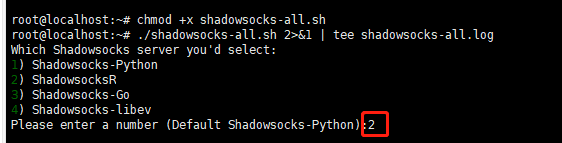
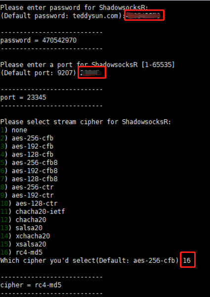
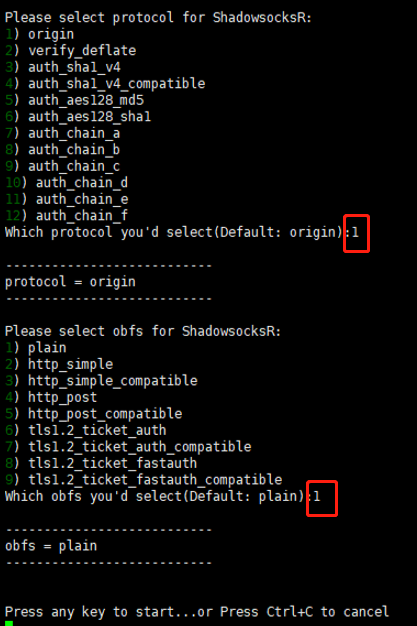

`SSR`软件安装完成后，所有的设定信息都会显示出来

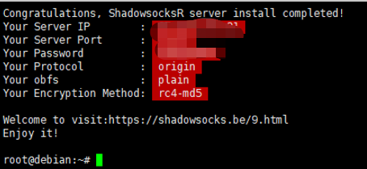

至此，服务器上安装`SSR软件`结束。

### 安装SSR客户端

`SSR`客户端下载地址：

Windows/OSX：https://github.com/shadowsocks/shadowsocks-windows/releases
Android: https://github.com/shadowsocks/shadowsocks-android
OSX: https://github.com/shadowsocksr-backup/ShadowsocksX-NG/releases
IOS: Potatso Lite、shadowrocket等软件

### 配置`SSR`客户端
以`Windows`端为例，运行`SSR`程序后，右键小飞机图标，选择编辑服务器，将之前安装服务器上`SSR软件`后的一系列信息填入。

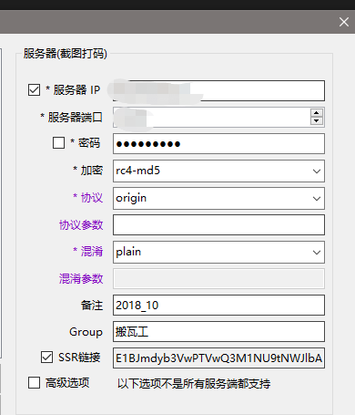

再右键，将模式设置为全局模式。

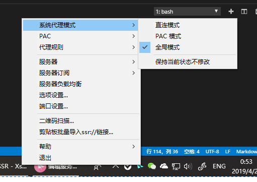

至此，一切步骤完成，可以打开游览器，尝试是否可以正常访问谷歌。

## BBR加速

BBR是一套TCP拥塞控制算法，由谷歌开源并提交到Linux内核，在Linux4.9以上，可以使用这套算法来加速网络访问速度。

先使用以下命令来检测Linux内核版本

```text
uname -r
```

大于4.9就可以直接切换，如果小于4.9的话，可以选择安装更高版本的OS。

之后通过以下命令只要下载并运行脚本

```text
wget --no-check-certificate https://github.com/teddysun/across/raw/master/bbr.sh && chmod +x bbr.sh && ./bbr.sh
```

完成后运行以下语句验证BBR是否正常工作

```
sysctl net.ipv4.tcp_congestion_control net.core.default_qdisc
```

显示以下结果说明运行成功

```text
net.ipv4.tcp_congestion_control = bbr
net.core.default_qdisc = fq
```

如果在安装过程中遇到任何问题，可以直接在下面评论区提出。


1. SS原工程 https://github.com/shadowsocks/shadowsocks
2. SS作者关于安全性的回复 https://github.com/shadowsocks/shadowsocks/issues/169
3. https://sphard3.github.io/ssr/ssr.html
4. SSR服务端安装脚本作者 https://teddysun.com/486.html/comment-page-60#comments



[^1]: [原工程](https://github.com/shadowsocks/shadowsocks)目前只剩下了一条Commit

[^2]: https://github.com/shadowsocks/shadowsocks/issues/169