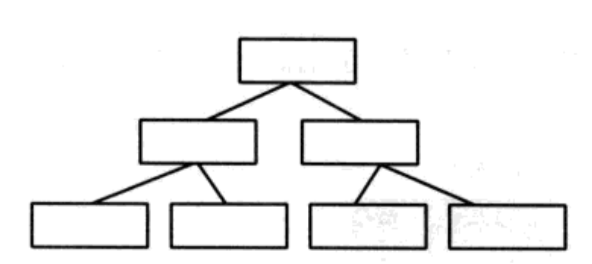
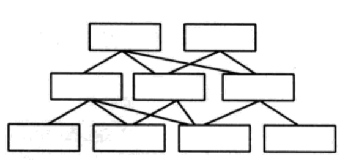
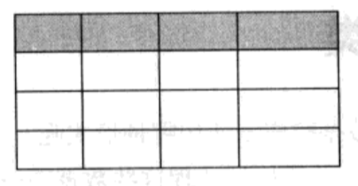

《漫画数据库》 第一、二、三章笔记。

包括介绍数据库的一些术语限定，关系运算，E—R模型介绍，以及表格规范化。

<!--more-->

## Chapter 1. What is a database

1. 一个所有数据被每个人共享的系统称为数据库，数据不共享会导致很多问题如内存浪费和数据不同步。
2. 数据库是被多人使用的，所以它必须提供方便的输入和输出接口。
3. 数据库的安全性和权限需要被关注。
4. 数据库的并行处理（如多个人同时修改一个数据）需要被关注。
5. 数据库需要有错误恢复机制来处理异常情况，如磁盘损坏，数据意外丢失等。

DBMS-Database management system

## Chapter 2.What is a relational detabase?

### 术语限定

如有一个表

| 产品ID | 产品名 | 单价  | 备注   |
| ------ | ------ | ----- | ------ |
| 101    | 西瓜   | 800 G | 有种子 |
| 102    | 草莓   | 150 G |        |
| 103    | 苹果   | 120 G |        |
| 104    | 柠檬   | 200 G |        |

表中每一列称为`字段（Field）`，每一行称为`记录（Record）`。可以理解为一个产品就是一个`记录`，产品的一个属性称为`字段`。每一个`记录`都有一系列相同类型的`字段`。

表中每一个`记录`的产品ID都是不同的，而类似于单价这样的字段可能存在重复，我们称这些不会有重复的字段为`唯一（Unique）`。

像字段备注中，有一些数据为空，这些空的数值称为`空值（Null）`

### 不同类型的数据库

1. 有宛如树形结构的数据库，称为`层次数据模型（Hierarchical Data Model）`，在层次数据模型中，每个字子数据都只有一个母数据。

    

2. 有网状结构的数据库，称为`网状数据模型（Network Data Model）`，在网状数据模型中，每个子数据都有多个母数据
   
    

3. 还有二元表状的数据库， 称为`关系数据模型（Relational Data Model）`
   
   

在关系数据模型中，称表格为`关系（Relation）`，之前的`记录`也称为`行`，之前的`字段`也称为`列`。像产品ID这样关键的，作为记录标识的字段，称为`主键(Primary key)`。

### 关系运算

关系数据模型可以用数学概念来处理数据。

关系数据模型一共有8个操作，分别为`并（Union）`,`差（Difference）`,`笛卡尔积（Cartesian Product）`,`除（Division）`,`交（Intersection）`,`投影（Projection）`,`选择（Selection）`,`连接（Join）`，这些操作都可以相互组合。

如存在两个表

| 商品名称 | 单价 |
| -------- | ---- |
| 西瓜     | 800G |
| 草莓     | 150G |
| 苹果     | 120G |
| 柠檬     | 200G |

| 商品名称 | 单价 |
| -------- | ---- |
| 西瓜     | 800G |
| 草莓     | 150G |
| 栗子     | 200G |
| 柿子     | 350G |

1. 并（Union）

    并操作，就是将两个表的记录合并在一起，形成一个总表。并操作结果为：

    | 商品名称 | 单价 |
    | -------- | ---- |
    | 西瓜     | 800G |
    | 草莓     | 150G |
    | 苹果     | 120G |
    | 柠檬     | 200G |
    | 栗子     | 200G |
    | 柿子     | 350G |

2. 差（Difference）

    差是求两个表差异的记录，如表一差表二，结果为

    | 商品名称 | 单价 |
    | -------- | ---- |
    | 苹果     | 120G |
    | 柠檬     | 200G |

    表二差表一，结果为

    | 商品名称 | 单价 |
    | -------- | ---- |
    | 栗子     | 200G |
    | 柿子     | 350G |

3. 交（Intersection）

    交是求两表相同的记录，交的结果为

    | 商品名称 | 单价 |
    | -------- | ---- |
    | 西瓜     | 800G |
    | 草莓     | 150G |

4. 笛卡尔积（Cartesion Product）

    笛卡尔积是求两个表所有行的排列组合，如有商品表和出口国表

    | 商品编码 | 商品名称 | 单价 |
    | -------- | -------- | ---- |
    | 101      | 西瓜     | 800G |
    | 102      | 草莓     | 150G |
    | 103      | 苹果     | 120G |

    | 出口国编码 | 出口国名称 |
    | ---------- | ---------- |
    | 12         | 米纳米王国 |
    | 23         | 阿尔法王国 |
    | 25         | 理陀儿王国 |

    两表笛卡尔积的结果为：

    | 商品编码 | 商品名称 | 单价 | 出口编码 | 出口国名称 |
    | -------- | -------- | ---- | -------- | ---------- |
    | 101      | 西瓜     | 800G | 12       | 米纳米王国 |
    | 101      | 西瓜     | 800G | 23       | 阿尔法王国 |
    | 101      | 西瓜     | 800G | 25       | 理陀儿王国 |
    | 102      | 草莓     | 150G | 12       | 米纳米王国 |
    | 102      | 草莓     | 150G | 23       | 阿尔法王国 |
    | 102      | 草莓     | 150G | 25       | 理陀儿王国 |
    | 103      | 苹果     | 120G | 12       | 米纳米王国 |
    | 103      | 苹果     | 120G | 23       | 阿尔法王国 |
    | 103      | 苹果     | 120G | 25       | 理陀儿王国 |

    笛卡尔表的结果就是将原先两个表的记录都排列组合。

> 并、差、交和笛卡尔积都为集合运算

5. 投影（Projection）
   
    投影是求表中的某列（可以一列或多列），结果如

    | 产品名 |
    | ---- |
    | 西瓜 |
    | 草莓 |
    | 苹果 |
    | 柠檬 |

6. 选择（Selection）
   
   选择是求表中的某行（可以一行或多行），结果如

   | 商品名称 | 单价 |
   | -------- | ---- |
   | 香瓜     | 800G |

7. 连接（Join）
   
   如存在两个表，商品表和销售表

   | 商品编码 | 商品名称 | 单价 |
   | -------- | -------- | ---- |
   | 101      | 西瓜     | 800G |
   | 102      | 草莓     | 150G |
   | 103      | 苹果     | 120G |
   | 104      | 柠檬     | 200G |

   | 日期 | 商品编码 | 数量 |
   | ---- | -------- | ---- |
   | 11/1 | 102      | 1100 |
   | 11/1 | 101      | 300  |
   | 11/5 | 103      | 1700 |
   | 11/8 | 101      | 500  |

   连接操作是将两个表通过相同的字段连接起来，这里的字段即为`商品编码`。结果为

    | 日期 | 商品编码 | 商品名称 | 单价 | 数量 |
    | ---- | -------- | -------- | ---- | ---- |
    | 11/1 | 102      | 草莓     | 150G | 1100 |
    | 11/1 | 101      | 香瓜     | 800G | 300  |
    | 11/5 | 103      | 苹果     | 120G | 1700 |
    | 11/8 | 101      | 香瓜     | 800G | 500  |

    我们将销售表中的商品编码称为`外键(foreign key)`，外键参照其他表中的`主键`进行联合。

8. 除（division）

    除运算就是在`被除表格`中找到`除表格`中所包含的行，并将`除表格`中的字段去除的操作。如有两个表销售表和出口国表，前者为被除表格，后者为除表格

     | 出口国编码 | 出口国名称 | 日期 |
     | ---------- | ---------- | ---- |
     | 12         | 米纳米王国 | 3/5  |
     | 12         | 米纳米王国 | 3/10 |
     | 23         | 阿尔法王国 | 3/5  |
     | 25         | 理陀儿王国 |

     | 出口国编码 | 出口国名称 |
     | ---------- | ---------- |
     | 12         | 米纳米王国 |
     | 23         | 阿尔法王国 |

     结果为

     |日期|
     | --- |
     | 3/5 |
     |3/10 |

     > 注意，除的结果不包含重复行

## Chapter 3. Let us Design a databases

### E-R模型

可以使用E-R模型帮助分析问题和设计数据库，E表示`实体（Entity）`，R表示`关系（Relationship）`。

现实生活中物体可以标识为`实体`，如水果和出口目的地，`实体`间的交互称为`关系`，如我们将水果卖到出口目的地，“卖”就是`关系`。

有多种水果也有多个出口目的地，所以这个例子中的两个实体都代表多个对象，这个关系称为`多对多关系`。在`E-R模型`中实体的数量也需要被考虑。如果只将一种水果卖给多个地方，就为`一对多关系`。这种实体间对应的个数称为`基数(Cardinality)`。

### 规范化表格

为了避免数据冲突（同一个数据在不同表中不一样，可能因为部分未更新而造成）而将表格拆分开的过程称为`规范化（Normalized）`。

1. `非范式（Unnormalized）`表格存在一个记录的一个字段存在多个数值，如
    | 报表编码 | 日期 | 出口国编码 | 出口国名称 | 商品编码 | 商品名称 | 单价 | 数量 |
    | -------- | ---- | ---------- | ---------- | -------- | -------- | ---- | ---- |

    因为一次报表可以买多个商品，所以一个报表编码可以对应多个商品编码，因此该表为非范式表格。

2. `第一范式（First Normal）`的表格满足一栏中只有一个项目，每一列都是不可分割的基本数据项。我们将上表拆分，可以得到第一范式表格，主要就是将商品编码与报表编码拆分。

    | 报表编码 | 日期 | 出口国编码 | 出口国名称 |
    | -------- | ---- | ---------- | ---------- |

    | 报表编码 | 商品编码 | 商品名称 | 单价 | 数量 |
    | -------- | -------- | -------- | ---- | ---- |

    表一中，报表编码为主键
    表二中，报表编码和商品编码的**组合**为主键。并不是表示表二存在两个主键。

3. 满足主键值可以确认其他列的表格称为`第二范式`表格。如果主键是多个字段的组合，那么其他列必须同时受这多个字段的控制。
   
   本例中，如果关注`第一范式中`的表二，可以发现商品的名称和单价也存在与表格中，但实际上这两者只受`商品编码`控制（即使我们只知道`商品编码`，我们也能知道单价和名称），而表二的主键是`商品编码`和`报表编码`的组合，因此表二并不符合`第二范式`要求。我们可以将表二进行拆分。

   表一保持不变
   | 报表编码 | 日期 | 出口国编码 | 出口国名称 |
   | -------- | ---- | ---------- | ---------- |

   表二拆分为
   | 报表编码 | 商品编码 | 数量 |
   | -------- | -------- | ---- |

   | 商品编码 | 商品名称 | 单价 |
   | -------- | -------- | ---- |

   拆分出的第一个表，主键为`报表编码`和`商品编码`的组合。第二个表格，主键为`商品编码`。

4. 满足主键值唯一确定其他列（即不存在间接性确认）的表格称为`第三范式`表格。

    在上面的表一中，存在间接性确认。`出口国名称`虽然受`报表编码`的控制，但实际上是出口国名称受`出口国编码`影响，出口国编码受`报表编码`控制。所以存在间接控制，不满足`第三范式`。
    
    因此将表一进行拆分为两个表格

    | 报表编码 | 日期 | 出口国编码 |
    | -------- | ---- | ---------- |

    | 出口国编码 | 出口国名称 |
    | ---------- | ---------- |

    表一的主键为报表编码，表二的主键为出口国编码。
    剩下的表格保持不变，即

    | 报表编码 | 商品编码 | 数量 |
    | -------- | -------- | ---- |
    
    | 商品编码 | 商品名称 | 单价 |
    | -------- | -------- | ---- |

现在我们一共有四个表，表一中的`出口国编码`参照表二的主键`出口国编码`，表一与表二连接。同理表三中的`报表编码`参照表一的主键`报表编码`，表三与表一连接。表三中的`商品编码`参照表四的主键`商品编码`，表三与表四连接。

不同表格建立相互联系的键叫做`外键（Foreign Key）`，外键用来参照其他表格的主键。表一中的`出口国编码`，表三中的`报表编码`,`商品编码`，三者都是`外键`。

### 设计数据库

设计数据库的步骤可以分为`概念模式`，`内部模式`,`外部模式`三部分

1. 概念模式：将现实世界模型化确认数据库理论结构的阶段。概念模式是通过E-R模型描述现实世界，并进一步规范化表格实现的。
2. 内部模式：内部模式从计算机内部物理构造考虑，设计目的是让数据库可以被高速检索。
3. 外部模式：外部模式是从用户和应用角度来考虑，设计目的是让用户和程序可以方便使用。



引用：

1. *The Manga Guide to Databases* 2009



***