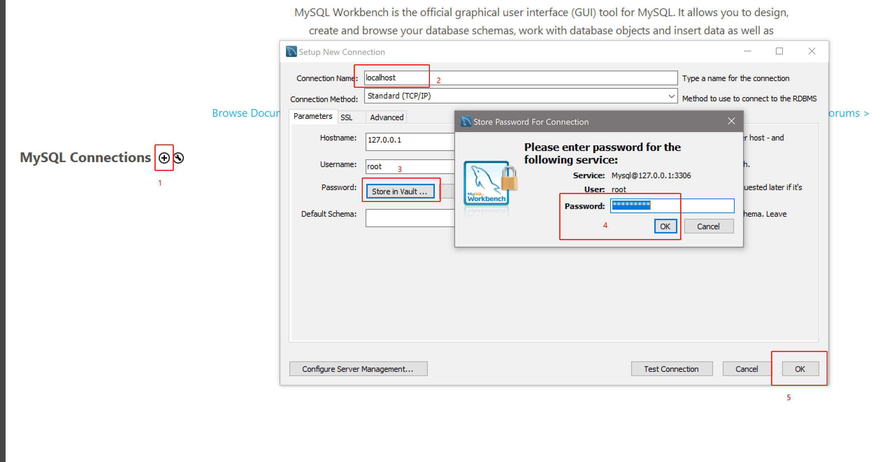
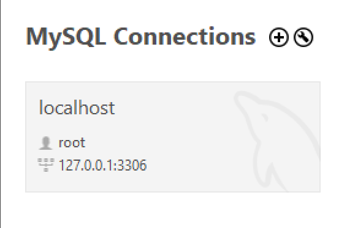
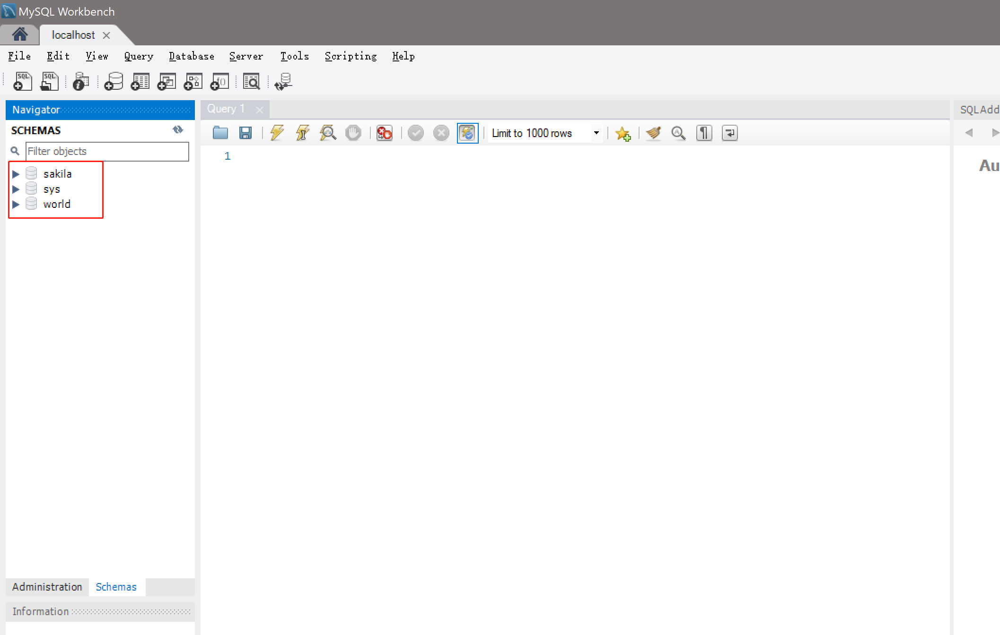
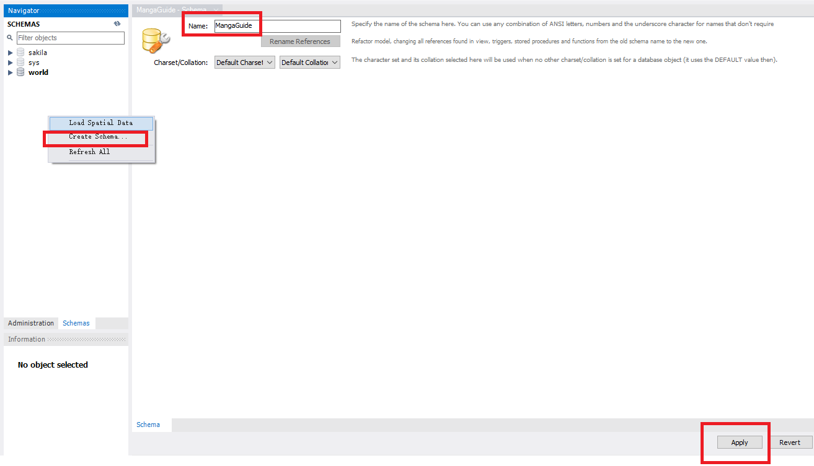
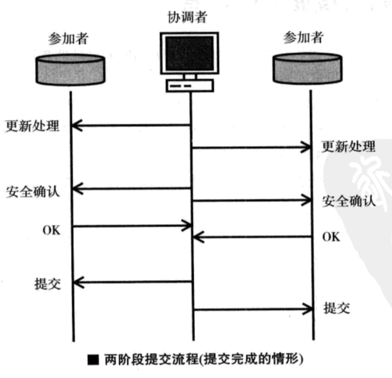
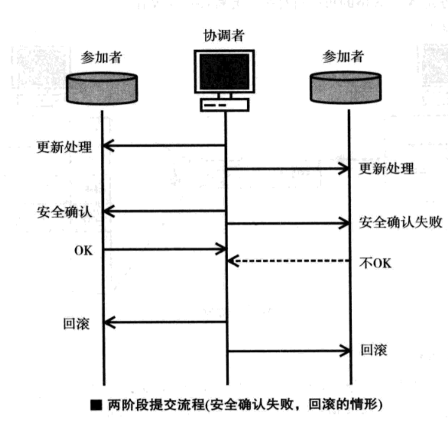

《漫画数据库》 第四、五、六章笔记。

包括介绍SQL环境的配置，SQL语言的基本操作，事物的概念，数据库部分优化概念及分布式数据库。


<!--more-->

## MySQL环境配置

《漫画数据库》一书没有说明如何配置MYSQL环境，而在第四章中却开始说明一些SQL语句，这就导致读者没地方实践语句。

在这里先简单介绍如何配置MySQL环境，主要参考网上的[MySQL教程](http://www.mysqltutorial.org/)。

1. MySQL程序安装

    Windows系统上可以直接安装[MySQL全家桶](https://dev.mysql.com/downloads/windows/installer/8.0.html)来完成SQL环境的配置。

    安装过程基本傻瓜式，但需要注意在安装中有设置密码的步骤，这个密码在之后登陆服务器时会用到。

    安装过程并没有直接将`MySQL Server`添加到系统环境中，`MySQL Server`的安装地址默认在于`C:\Program Files\MySQL\MySQL Server 8.0\bin`，将这个地址默认添加到系统环境中即可，关于如何添加系统环境这里不赘述。

2. 通过Shell连接MySQL
   
    配置完成后，可以通过命令`mysql -u <userName> -p`登陆Server，这里需要输入密码，密码即为安装过程中设置的那个。

    ```mysql
    PS C:\Users\wxj> mysql -u root -p
    Enter password: *********                                                      Welcome to the MySQL monitor.  Commands end with ; or \g
    ```
    可以使用命令 show databases来查看目前的数据库

    ```mysql
    mysql> show databases;
    +--------------------+
    | Database           |
    +--------------------+
    | information_schema |
    | mysql              |
    | performance_schema |
    | sakila             |
    | sys                |
    | world              |
    +--------------------+
    6 rows in set (0.00 sec)
    ```
3. 通过MYSQL WorkBench连接MySQL
   
   

   如图打开workBench后依次点击，操作分别是增加连接，设置连接名字（任取），设置密码，确认密码设置，确认连接设置。添加完成后效果如下图所示，
   
   

   双击连接便能打开数据库界面。

   

   注意红框处的数据库名称与我们通过shell所展现的是一样的。在右侧的Query窗口可以编写SQL语句

4. 使用MySQL Workbench新建数据库
   
   在SCHEMAS界面邮件，选择新建数据库，然后设置新数据名字并Apply即可
   
   

   创建完成后，同样在SCHEMAS界面，双击新形成的数据库将他设置为默认的数据库即可。

5. 执行SQL文件
   
   在设置完默认的数据库后，运行的SQL文本会自动基于当前的数据库。可以只用快捷键`Ctrl+Shift+Enter`执行整个SQL文件的命令，或使用`CTRL+ENTER`执行当前语句的命令。
   
## Chapter 4. Let us learn about SQL

1. 数据定义语言（Data Definition Language，DDL）
   用来创建、更改和删除表
2. 数据操作语言（Data Manipulation Language，DML）
   用来操作数据，如插入，更改，删除数据
3. 数据控制语言（Data Control Language，DCL）
   用来控制数据库，如保护多人同时使用数据库也不会有冲突

SQL的`命令(Statement)`是由`短语(Phrase)`组成的，如`SELECT`,`WHERE`都为短语。

### 创建表格

使用短语`CREATE TABLE`创建表格

```sql
CREATE TABLE <TableName>
(
    <FieldName> <FieldType>
    PRIMARY KEY(<FieldName>)
)

如

create table if not exists `SALES_TABLE`
(
`REPORT_CODE` int Not NULL,
`EXPORT_DATE` date,
`EXPORT_DESTINATION_CODE` int,

primary key(REPORT_CODE) -- set primary Key
);

```

使用短语`ALTER`修改表格

```sql
ALTER TABLE <TableName>
<Phrase>

-- 为product_table 表格增加DISTRICT列，且让他排在`UNIT_PRICE`后
alter table product_table
add column `DISTRICT`  VARCHAR(45) null
after `UNIT_PRICE`;

```

### 表格添加及删除数据

使用短语`Insert into`及`values`来添加数据

```sql
insert into <TableName>(<FieldName1>,<FieldName2>)
values
    (<Field1Data>,<Field2Data>),
    (<Field1Data>,<Field2Data>);

-- 如

insert into
	sales_table(REPORT_CODE,EXPORT_DATE,EXPORT_DESTINATION_CODE)
values
	(1101,'2019-03-05',12),
    (1102,'2019-03-07',23),
    (1103,'2019-03-08',25),
    (1104,'2019-03-10',12),
    (1105,'2019-03-12',25);
```

使用`delete from`及`where`短语删除数据

```sql
delete from <TableName>
where <condtion>;

-- 如

delete from product_table
where PRODUCT_CODE=101;
```

使用`update`,`set`,`where`更新数据

```sql
update <tableName>
set <FieldName>=<FieldData>
where <Condition>

-- 如
update product_table set DISTRICT='South Sea' where PRODUCT_CODE=101 or PRODUCT_CODE=104;
update product_table set DISTRICT='Middle' where PRODUCT_CODE=102;
update product_table set DISTRICT='North Sea' where PRODUCT_CODE=103;
```


### 查看数据

使用短语`SELECT FROM`，`WHERE`，以及`比较运算符`,`关系运算符`以及`通配符`来选择数据，SQL支持的比较运算符和关系运算符如下：

| 比较运算符 | 含义       | 关系运算符 | 含义 | 通配符 | 含义                   |
| ---------- | ---------- | ---------- | ---- | ------ | ---------------------- |
| A = B      | A等于B     | AND        | 与   | *      | 匹配任意长度的任意字符 |
| A > B      | A大于B     | OR         | 或   | -      | 匹配长度为1的任意字符  |
| A >= B     | A大于等于B | NOT        | 非   |        |                        |
| A < B      | A小于B     |            |      |        |                        |
| A <= B     | A小于等于B |            |      |        |                        |

语句形式如下
```sql
select <FieldName>
from <TableName>
where <condition>;

-- 如搜索数量大于1000的产品,且显示表中所有数据

select * from sales_statement_table
where QUANTITY>1000;

-- 这里使用了*来表示所有数据，如果我们仅想显示一个PRODUCT_CODE

select PRODUCT_CODE from sales_statement_table
where QUANTITY>1000;

-- 取所有产品名以n结尾的产品
select * from product_table
where PRODUCT_NAME like '%n';
```

SQL还自带了一些函数帮助计算，如求最大值，求行数等

| 函数                         | 含义                     |
| ---------------------------- | ------------------------ |
| COUNT(*)                     | 求行数                   |
| COUNT(`FieldName`)           | 求非空值行的行数         |
| COUNT( Distinct `FieldName`) | 求除了空值和重复值的行数 |
| SUM(`FieldName`)             | 求各行总和               |
| AVG(`FieldName`)             | 求各行平均               |
| MAX(`FieldName`)             | 求各行最大               |
| MIN(`FieldName`)             | 求各行最小               |

如
```sql

-- 求一共有几个数量大于1000的销售产品
select COUNT(*) from sales_statement_table
where QUANTITY>1000;
```
### 分组计算

使用短语`group by`进行分组

```sql
select <FieldName>
from <TableName>
group by <FieldName>
```

如有列表
| PRODUCT_CODE | PRODUCT_NAME | UNIT_PRICE | DISTRICT  |
| ------------ | ------------ | ---------- | --------- |
| 101          | MELON        | 800        | South Sea |
| 102          | STRAWBERRY   | 150        | Middle    |
| 103          | APPLE        | 120        | North Sea |
| 104          | LEMON        | 200        | South Sea |
| 201          | Chestnut     | 100        | North Sea |
| 202          | Persimmon    | 160        | Middle    |
| 301          | Peach        | 130        | South Sea |
| 302          | Kiwi         | 200        | South Sea |

想通过DISTRICT进行分组，可以使用

```sql
select DISTRICT,AVG(UNIT_PRICE),UNIT_PRICE
from product_table
group by DISTRICT;
```

这里选择的是分组完后价格的平均值，输出结果为
| DISTRICT  | AVG(UNIT_PRICE) | UNIT_PRICE |
| --------- | --------------- | ---------- |
| South Sea | 332.5           | 800        |
| Middle    | 155             | 150        |
| North Sea | 110             | 120        |

因为表的一项只能显示一个数值，所以在分组后的`UNIT_PRICE`项，只能显示这个分组的第一个数值。

分组完后的数据如果需要筛选，应该使用短语`having`而非`where`

```sql
select DISTRICT,AVG(UNIT_PRICE),UNIT_PRICE
from product_table
group by DISTRICT
having AVG(UNIT_PRICE)>=200;

select DISTRICT,COUNT(*)
from product_table
group by DISTRICT
having count(*)>=3;

```

结果为
| DISTRICT  | AVG(UNIT_PRICE) | UNIT_PRICE |
| --------- | --------------- | ---------- |
| South Sea | 332.5           | 800        |

| DISTRICT  | COUNT(*) |
| --------- | -------- |
| South Sea | 4        |


### 使用子查询检索

例如我们需要打印出销售额大于1000的产品名称，销售额是在销售表中，产品名称是在产品表中，这时就需要用到子查询。先重销售表中查询处满足条件的记录，再基于得到的记录查询名称。`子查询(Subquery)`使用短语`In`即可，这里是相当于先运行了括号内的内容，再执行外部的查询。

```sql
select * from product_table
where PRODUCT_CODE IN
(select PRODUCT_CODE from sales_statement_table
where QUANTITY>=1000);
```

另外还有`相关子查询(CORRELATED SUBQUERY)`，相关子查询最大的区别是先运行括号外的内容，再将结果一条条传递给括号内的查询，如

```sql
select * from sales_statement_table U
where QUANTITY >
(
	select avg(QUANTITY)
    from sales_statement_table
    where PRODUCT_CODE=U.PRODUCT_CODE
);
```

这里将外部查询的表`sales_statement_table`命名为U，并将查询的结果传递给内部查询。例如`sales_statement_table`表中的第一个元素的PRODUCT_CODE为101，那么实际上在第一次运行时，内部查询相当于

```sql
	select avg(QUANTITY)
    from sales_statement_table
    where PRODUCT_CODE=101
```

得到结果后，再将结果（这里是平均值）传递给外部查询。这个相关子查询的工作是找出订单产品销售额大于该产品平均销售额的订单。

### 制作视图

`视图(View)`相当于是一个虚拟表，它仅是用来被用户查看。生成视图的表成为`基表(Base table)`，使用短语`Create view`创建

```sql

create view <ViewName>(<ViewField>) -- 如果Field完全与BaseTable一样，可忽略
as select * 
from <BaseTableName>
where <Condition>;

-- 如

create view expensive_product_table
as select * 
from product_table
where UNIT_PRICE>=200;

```

### 删除视图与表

使用短语`drop`

```sql
drop view <ViewName>;
drop table <TableName>;
```

## Chapter 5. Let us operate a databases

### 事物

用户的一系列成功操作成为`事物(Transaction)`。数据库必须保证即使多个事物同时执行，也不会发生矛盾，和即使事物处理过程中发生了意外，数据也不允许发生矛盾。数据库事物通过具有`ACID`属性来保证不会产生数据矛盾。

| 属性                     | 含义                                                 |
| ------------------------ | ---------------------------------------------------- |
| A（Atomicity），原子性   | 事物必须结束于提交或回滚                             |
| C（Consistency），一致性 | 执行数据库事物时不能损坏数据库的一致性               |
| I（Isolation），隔离性   | 多个事物的执行时互不干扰的                           |
| D（Durability），持久性  | 事物完成后，事物对于数据的更改会持久的保留在数据库中 |

1. Atomicity，原子性
   
   事物必须以`提交(Commit)`或者`回滚(Rollback)`作为结束，提交是确定数据库事物的处理，回滚是取消事物处理的指令。提交和回滚是自动执行，但也能通过命令`COMMIT`和`ROLLBACK`来显示执行。

2. Consistency，一致性
   
   如描述，数据库需要保证不会损坏数据库数据的一致性

3. Isolation，隔离性
   
   如果多个事物同时执行并返回了同样的结果，将这一些列事物称为`安排（Schedule）`，并称这些安排是`可序列化(Serializable)`的。事物的隔离性要求安排必须是可序列化的。

   通常我们使用`锁(Lock)`来满足可序列化，锁又分为`共享锁(shared lock)`和`独占锁(exclusive lock)`，前者是读取数据时使用，后者是写入数据时使用。使用共享锁时，其他事务可以假设共享锁，但是不能加设独占锁。使用独占锁时，其他事务不能加设任何锁。

   为了确保事务可以序列化，需要遵守一定的规则，规则其中一项就是`两阶段封锁(two-phase locking)`（书中未做详细解释）。

    另外还需要注意锁的`粒度(Granularity)`。粒度越大表示锁控制的数据就越大，这样一个事务设锁的次数会减少可以减少CPU负担，但是因为加锁的数据大，导致等等的对象会增多且等待时间上，所以同时可以执行的事务就减少了。反之同理。

    除了加锁外，还有其他的控制方法。如`时间戳控制(Timestamp control)`和`乐观控制(Optimistic control)`。
        （1） 时间戳控制是在执行一个事务时指定一个时间戳，当有另一个事务以更新的时间戳更新数据时，之前时间戳的事务将会被静止并回滚。

        （2） 乐观控制允许读操作，而在写操作时会检查是否有其他的事务已经更新了数据，如果有回滚该操作。
    
    在实际运用中，实际上可以设定`隔离等级(Levels of islation)`,隔离等级分为四个,`READ UNCOMMITTED`，`READ COMMITEED`,`REPEATABLE READ`,`SERIALIZABLE`,默认为`SERIALIZABLE`。

    根据隔离等级的不同，可能发生以下现象

    |                  | 脏读     | 非重复读 | 虚读     |
    | ---------------- | -------- | -------- | -------- |
    | READ UNCOMMITTED | 可能发生 | 可能发生 | 可能发生 |
    | READ COMMITEED   | 不发生   | 可能发生 | 可能发生 |
    | REPEATABLE READ  | 不发生   | 不发生   | 可能发生 |
    | SERIALIZABLE     | 不发生   | 不发生   | 不发生   |

    `脏读（Dirty Read）`表示在事物1提交前，事物2就读取了某数据。

    `非重复读(Non-repeatable Read) `表示一个事务重复读取了两次数据，然后得到了不一样的值。可能原因就是其他的事务并行的更新了数值。

    `虚读（Phantom Read）`表示一个事务搜索匹配某模式的数据时返回了错误值但是因为其他的事务在并行的更新数据，所以搜索到了错误数据。

4. 持久性（Durability）
   
   可以使用命令`GRANT`指定用户访问数据库或者表的权限,被授权的用户也可以附带`WITH GRANT OTION`信息来给其他用户权限，在取消某用户权限时，可以使用`REVOKE`。可设定的权限包括`SELECT`,`INSERT`,`UPDATE`,`DELETE`,`ALL`。

   另外可以使用视图来管理权限，如将表格中的一部分数据生成视图，然后针对视图给用户权限。

   ```sql
   GRANT <Privileges> ON <TableName or viewName> TO <User> (WITH GRANT OPTION);

   GRANT SELECT,UPDATE ON product_table TO business_department;
   GRANT SELECT,UPDATE ON product_table TO overseas_business_department with grant option;
   REVOKE SELECT,UPDATE ON product_table FROM business_department;
   ```

### 异常处理

数据库必须包含某种机制来保证意外发生时数据仍然正确。可能的意外包括

1. 事务错误（Transaction failure）
   
   当事务错误发生时，事务将无法被提交，将会进行回滚处理。

2. 系统错误（System failure）
   
   如发生断电等情况，将发生系统错误，在系统重启后，未提交的事务将会被`回滚(Roll backward)`，已经提交的事务将会进行`前滚（Roll forward）`。

   这里已经被提交的事务限定在上一个`检查点(CheckPoints)`后的提交。检查点的生成与缓存数据相关，在数据库写入数据时会被短暂的存储在缓存中，当缓存内的数据和数据库同步后，将会生成一个检查点。
3. 介质错误（Media failure）
   
   包含数据的硬盘发生损坏时称为介质错误。在这种情况下，将会恢复备份数据且在备份数据生效后，事务将会被前滚。

### 索引

当数据库非常庞大时，搜索特定数据可能会需要花费很长的时间，这时候就需要用到`索引(Indexes)`。索引有两种方式，`B树`和`散列（Hash）`。

1. B树
   B树相当于用树形结构来存储数据，每个节点都是经过了排序的，每个父节点都包含了子节点中最大值和最小值的信息，这样就可以加快节点的搜索。

2. 散列

   散列通过一个散列函数来求得数据的存储地址，但散列只适用于完全一致的搜索，如`找寻编码为101的数据`，而类似`找寻值大于XX` 这样的搜索就不匹配。


### 搜索优化

如存在一个搜索命令

```sql
SELECT dates,product_name
FROM product,sales
WHERE unit_price >= 200
AND product.product_code = sales.product_code
```

这个操作可以看作由三个步骤组成

1. 将产品表和销售表两个表组合在一起
2. 找出单价大于200的产品
3. 抽出日期和产品名两列

但这样的三个步骤可以有两种排列方式（1）按上述的步骤进行执行（2）先在两个表中各自抽出相关列，然后在产品表中找出满足条件的产品，然后在将两列结合在一起。

第二种方式有更高的效率，因为先抽取了列然后选择可以减少最后合并的工作量。

通常数据库的操作按照，先选择，在投影，最后合并的操作顺序，这样可以减少相关的工作量。

#### 合并操作优化

对于合并操作来说，也有三种合并实现方式

1. 嵌套循环
   
   即先从需要合并的表一找出需要合并的一行，然后遍历搜寻表二中符合的行。然后在表一中寻找需要合并的下一行

2. 排序合并
   
   即先对两个表各自排序，然后再合并。因为排序后两个表都可以按照一个顺序来合并，所以会提升效率。但需要考虑排序的时间。

3. 散列
   
   即通过散列函数快速的找到需要合并的两个表匹配的数据。

#### 优化原则

1. 规则导向
   
   因为对于一个操作，可以有不同的执行顺序但能获取一样的结果。所以可以预先多个规则来指定步骤的执行顺序，如之前的`先选择，在投影,最后合并`就是一个规则。

2. 成本导向
   
   成本导向是根据数据库内的统计数据，再根据这些数据来选择优化的方式。成本导向相对于规则导向更灵活，但需要定期生成统计数据，统计数据的生成和分析都需要花费额外的时间。

## Chapter 6. Databases are everywhere

### 网络与数据库

当网页与数据库一起工作时，整个系统由三层组成，称为三层客户端服务器(threetier client/server system)，包括`表示层(presentation layer)`，`逻辑层(logic layer)`和`数据层(data layer)`。
   
1. 表示层
   
   表示层接受用户输入，并会显示数据库检索结果。

2. 逻辑层
   
   逻辑层对SQL命令进整合，对数据进行加工

3. 数据层
   
   数据层由数据库服务器处理，对数据库进行查询，并返回检索结果。

### 使用存储程序

为了避免网络的数据传输，数据库有存储程序，可以存储一些高频的SQL查询命令。有三种存储程序，`存储过程（Stored procedure）`，`存储功能(Stored function)`和`触发器（Trigger）`。分别用来，存储没有返回值的才做，存储拥有返回值的操作，和在操作完成后自动存储。

### 分布式数据库

数据库本身可以被分散到不同的地点而通过网络相连接。尽管数据库被分散了，但是用户仍然可以把它当作一个数据库来进行处理。

数据库可分为`水平分布`和`垂直分布`两种，前者指的是使用多个同级别的数据库服务器的存储方式，这些服务器各自可以使用别的服务器的数据。后者指的是每个数据库服务器具有不同功能的分布方式，由承担主要任务的主服务器和承担其他处理任务的服务器构成。

分布式数据库的数据也必然是由各数据库服务器各自存储，而数据的分配方式也同样分为`水平分配`和`垂直分配`两种。水平分配指的是不同的服务器各自存储表的不同行（记录），而垂直分配则是不同的服务器各自存储表的不同列（字段）。

为了避免不同的数据库服务器同时操作而导致数据冲突，分布式数据库采用名为`两阶段提交(two-phase commit)`的方法。

两阶段提交包括有`协调者(coordinator)`和`参与者(participant)`且由两个阶段组成

1. 第一个阶段由协调者询问各参与者是否可以提交事物
   
2. 第二阶段是协调者根据参与者返回的结论，进行相关操作，如果所有参与者都返回可以提交，则进行提交，反之有任何一个参与者拒绝了提交，则回滚事物。

下图分别为成功提交和失败提交的例子。




### 数据库复制

在分布式数据库中为了减少网络的负载，数据库设置了复制功能。我们将主要的数据库服务器称为`主数据库(Primary database)`，以及存有复制数据的服务器成为`复制数据库(replica)`。

复制数据库分为`读取专用`和`可更新`两种，前者复制服务器仅能读取主数据库的信息，后者可以对数据进行修改并且同步给主数据库以及其他数据库。




引用：

1. *The Manga Guide to Databases* 2009



***