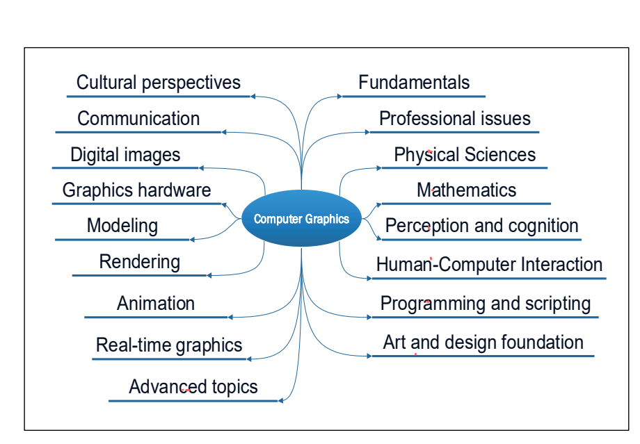
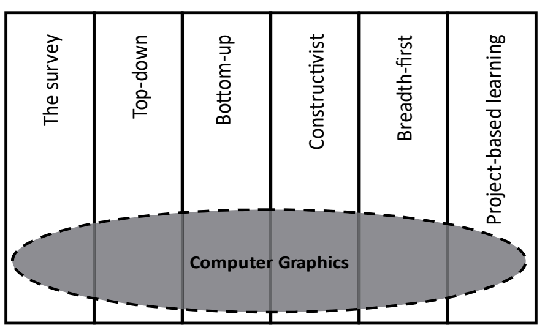



这篇论文中，作者表达了希望可以通过游戏来帮助图形学教学，并探讨了以下几个问题：

1. 图形学课程的范畴
2. 图形学不同教学方式
3. 电子游戏对于高等教育的帮助
4. 目前图形学课程中，交互式游戏的例子



<!--more-->

# The Use of Digital Games to Teaching Computer Graphics: an Open Opportunity



原文中有大量source作为例子，在这里不会将所有的被引用source的内容整理再次。

但会通过类似于`[2]`这样的标记，这个说明该部分内容在原文的第二篇引用中有详细说明。



## Introduction

3D空间想象的概念对于部分学生来说很难理解。

游戏和图形学都是需要可视化，而且都需要交互，所以这两者很匹配，有结合在一起的可能。

## The Computer Graphic Curriculum

> 这一部分作者首先讨论了图形学的范畴，然后阐述了多年来图形学教学的变化。

### The Computer Graphics Knowledge Base

在2006年的报告中，*ACM SIGGRAPH*将图形学分为了17个子领域`[1]`，如下所示：

### The Modern Computer Graphics Curriculum

在1970-1980年代，受限于昂贵的图形学硬件，只有少数的大学提供了图形学课程。课程也大多局限在底层的硬件教学，基本渲染算法和3D模型的介绍。
在1980-1990年代，图形学硬件相对来说价格变得容易承受了一些。图形学课程变为了大学教育中的常见课程，课程关注底层算法，图形学硬件，数学，光照和颜色的原理和一些基本API的使用。
从1990倒现在，因为图形学硬件变得更便宜，和一些高标准的图形学库出现（OpenGL，Direct3D），图形学课程设计变为选择更好的软件工具来提升教学体验，目前主流的教学都是选择C/C++以及OpenGL库。
因为目前大多数较低层的算法和整个渲染处理都被结合进硬件层，所以课程的主题也发生了很大的变换。现在对于不同层次和目标的图形学学习者，通常会覆盖不同的主题。如对于计算机科学的学生，可能仍然需要关注于数学和一些底层的渲染知识。对于软件工程的学生，可能更多的是学习一些高层的编程框架。对于媒体的学生，则是关注于一些图形建模的商业软件等。

### Some students on the CG syllabus

> 这里是作者总结了一些别人的关于图形学范畴大纲研究。

第一份报告`[17]`是在1990年代后期发布的，这一份报告研究了美国23个大学的图形学研究范畴。关注度最高的主题包括，摄像机/观察者坐标变换，硬件，光照模型，3D变换，用户交互，物体表示，阴影模型，颜色模型，曲线，隐藏表面取出，光栅化（viewing/camera transformations, hardware,lighting models, 3D transformations, user interaction, object representation, shading models, color models, curves, hiddensurface removal, and rasterization）。

第二份报告是在2005年发表`[18]`，这一份报告研究了超过70个学术项目课程。发现许多的课程已经不仅仅局限在传统的3D图形范畴，更关注于图形学，图像处理，人机交互三个领域的结合，而且对于2D内容的关注也逐渐加深。

第三方报告是在2016年发表`[19]`，这一份报告选取了美国近400个关于图形学的课程研究。发现上述第一份报告中主要关注的主题，现在都出现在了教科书中。而且现在的课程开始关注于工业与学术的联系。这一份报告同时建议，之前的图形学17个子领域应该缩减为9个`[3]`：艺术设计，动画，数字成像，物理，视觉感知，可视化通信，数学，认知科学，计算机编程(Art and design, animation, digital imaging, physics, visual perception, visual communication, mathematics, cognitive sciences, and computer programming)。另外图形学课程必须强调多学科的结合，其基本框架应该是科学，技术和艺术原则的结合。

在2013年，*ACM*和*IEEE*还发布了一个关于计算机课程的指导文件`[20]`，其建议课程应该包含图形学的基本概念，基本与高级渲染，几何模型，动画和可视化，每一个学习了图形学课程的学生应该都有能力进行2D/3D的坐标转换，同时有对于3D渲染的基本了解。

## General Approaches To Teaching Computer Graphics

> 这一部分作者总结了不同的图形学教学的方法

目前图形学的教学方式可以分为以下六种：

### Survey

调查法是提供一个对于图形学的笼统概念，而且并不提供编程相关的内容。

这一方法在图形学学科的初期被使用的较多，主要原因是当时并没有足够的软硬件进行其他的教学方式。

### Bottom-Up

自底向上法一开始学习一些最底层的算法，数学方法和其他的基本元素，然后逐渐的向更高层的知识学习。例如一开始学习如何画直线，如何画二维曲线，然后再一步步的变换为2D形状，3D形状。

很多经典的图形学书籍都是采用这个方法。

### Top-Down

`[8]`

自顶向下法一开始分析和实现一些图形学的软件，然后再逐渐的去了解其底层的知识。好比先学习如何开车，再学习汽车的构造等等。

这些年，大部分的教学都是通过自顶向下法。

自底向上法可能更适合于一些立志研究计算机科学的人，他们对底层的知识有更高的要求。而对于软件工程和艺术家而言，自顶向下法更为合适。

### Constructivist

`[26]`

建构法是老师不再为每个主题提供一个复杂的教学内容，而是去指引学生构建一个对于学科的概念知识。让学生可以通过对不同主题的教学内容进行可视化，实验，测试来得到知识。

### Breadth-First

`[27]`

广度优先法类似于自顶向下法。只不过广度优先更强调跨学科的尝试，而自顶向下法仍然是针对不同专业的人，给他们特定的学习内容。

### Project-Based Learning(PBL)

`[28]`

基于项目的学习法是让学生通过解决特定问题或完成项目来学习知识。

这一方法成立的前提是目前C++，OpenGL等语言和库已经相对成熟，学生可以很快的搭建出一个软件的框架。

## Digital Games as a Leaning Strategy In Higher Education

> 这一部分作者探讨了在高等教育中用电子游戏帮助学习的例子

电子游戏可以可以提供一个沉浸式的学习体验，在许多的学科研究中也已经证明了电子游戏帮助学习的有效性`[34,35]`。

现在也有一系列通过游戏来帮助学生学习编程的例子`[36,37,38,39]`。

对于软件工程的学生而言，基于游戏学习可以再细分为两种类型，第一种是真正的用游戏来学习（Game-Based Leaning,GBL），另一种是基于游戏开发的学习（Game-Development-Based Learning，GDBL）`[43]`

## The Use of Digital Games and Interactive Simulators to Teaching Computer Graphics

> 这一节作者针对说明了在图形学的教学中，用游戏和模拟方法来提升教学体验的例子

对于图形学的教学，除了上述的两种游戏教学法（GBL和GDBL），还有一种提供交互的模拟方法（simulator）。这种方法严格意义上无法被称之为是游戏，但学生同样可以通过交互进行修改参数之类的操作，来实时进行实验和看到变化。

### GDBL Approaches

这种方法是让学生通过开发一款游戏来了解图形学的知识。

主要的例子有`[44]`，其中老师开发了一款名为`GameX`的平台，学生在上面通过使用OpenGL和DirectX来进行开发游戏。而且他针对不同的学生，可以开放不同程度的API。

类似的还有`[45]`，一款名为`eNYyMyCar`的平台，其中学生可以共享和展示自己的开发成果。

还有`[46]也是一个实现，这个实现还结合了各种其他的游戏方面的知识。

### Interactive Simulators

Simulator的例子有`[47,48,49,50,51,52]`

这些例子都是通过让学生对某个主题的模拟程序进行交互，来查看效果。

### GBL approaches

`[54]`开发了一个网页游戏，学生通过解密学习知识。

`[55]`一款2016年的游戏，学生要通过各种坐标变换来获得游戏要求的形状。

## Discussion

作者从1990年到2016年，一共找到了11个交互的图形学教学，其中5个是交互模拟，4个是GDBL，2个是GBL。

交互模拟是最早出现的，但是绝大部分都是出现在90年代，只有1个是在2000年早期。
GDBL都是使用类似于OpenGL，Direct3D这样的框架让学生进行开发游戏。
GBL很少，所以作者认为在GBL的方面，还能有很多工作进行开展。



引用：

1. González-Campos, J. S., Arnedo-Moreno, J., & Sánchez-Navarro, J. (2018, April). The use of digital games to teaching computer graphics: An open opportunity. In 2018 IEEE Global Engineering Education Conference (EDUCON) (pp. 1988-1996). IEEE.



***