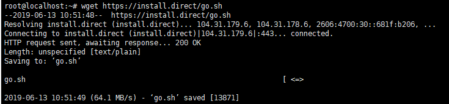
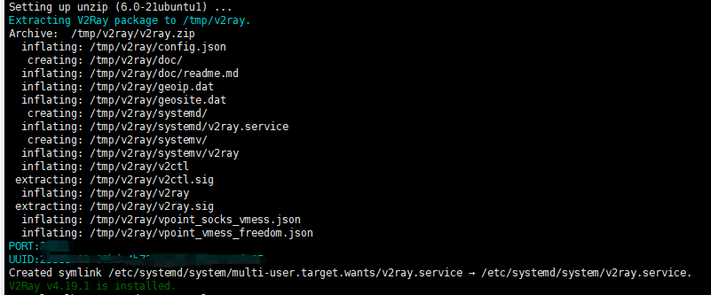



简单介绍V2Ray以及如何通过V2Ray搭建梯子。



<!--more-->

SS及SSR因为其易用性和使用人数的广泛，已经逐渐被GFW识别。在最近笔者以及朋友搭建的SSR都相继IP被禁。笔者可以理解而且在一定程度上支持的GFW的存在，但在一些情况下也不得不需要绕过GFW来找寻一些工作中需要的资料。这篇教程也是为那些同样有迫切需要的人而写，技术无罪，但切不可利用技术行恶。

## V2Ray概述

`V2Ray`是`ProjectV`下的一个工具。`ProjectV`是一个帮助打造专属基础网络通信的工具集合，`V2Ray`是其中最核心的一个工具，主要负责网络协议和功能的实现，目前最多的使用场景就是如同`SSR`通过特殊的网络协议绕开GFW的深度包检测。

## V2Ray服务端安装

使用`V2Ray`搭梯子同样需要购买VPS及使用`SSH`登录VPS，这一部分在之前的`ShadowsocksR 翻墙教程`已经做了说明，这里就不重复介绍了。这里为了避免安装过程中出现`command not found`等问题，建议使用`Debian 8.x`以上或`Ubantu 16.04`以上的版本操作系统，笔者使用的是`Ubuntu 18.04 x86_64`操作系统。

因为`V2Ray`的验证方式包含时间，客户端及服务端的时间误差必须在90秒内，这个时间误差是考虑了时区问题的，比如客户端位于东八区，时间为23点20分，服务端位于西四区，时间为11点20分，虽然绝对时间不同，但是这是因为时区造成的，实际两者不存在误差，即可以正常运行。

在成功通过SSH连接到VPS后可以通过`date -R`命令检查服务端（VPS）的时间及时区，如果结果存在问题，可以使用`date --set`命令来修改时间，如`sudo date --set="2017-01-22 16:16:23"`。

客户端的时间即为电脑或手机的时间，这里就不说明修改时间的方式了。

检查完时间后，通过运行`wget https://install.direct/go.sh`命令下载`V2Ray`安装脚本。

下载完成后，通过命令`sudo bash go.sh`运行脚本

安装后会有如上图的结果，其中`PORT`和`UUID`两项（即图中马赛克部分）需要记录下来，在之后客户端的配置中需要用到。

在安装后,`V2Ray`并不会自动启动，我们还需要通过命令`sudo systemctl start v2ray`手动启动`V2Ray`

如果以后需要更新`V2Ray`，再次运行安装命令`sudo bash go.sh`即可，这样会在保留配置文件的情况下更新`V2Ray`并重写启动。

可以使用命令`cat /etc/v2ray/config.json`来检查`V2Ray`的配置，后续章节会说明`V2Ray`的配置文件。

## V2Ray客户端安装

### 安卓版本

下载`V2RayNG`软件,Google商店可以搜索到，或者在[工程发布地址](https://github.com/2dust/v2rayNG/releases)下载对应`app-universal-release.apk`

软件安装成功后，点击右上角加号并选择`手动输入Vmess`，然后将服务器的地址，以及之前服务器安装成后，显示的`PORT`和`UUID`分别填入`端口`和`用户ID`两个选项中，加密方式选择为`Auto`即可。

### Windows版本

在[V2RayN工厂发布地址](https://github.com/2dust/v2rayN/releases)分别下载`v2rayN-Core`和`v2rayN`压缩包，并将其解压到一个目录下。

> v2rayN-Core官方发布地址为https://github.com/v2ray/v2ray-core/releases

之后在解压目录中找到`v2rayN`文件，并双击运行，在界面左上角选择`服务器-添加VMess服务器`并如上述安卓版本一样，将对应信息填入。服务器添加完成后，双击运行。为方便运行可以在系统右下角的折叠栏中找到`V2Ray`图标，右键并选择`启用HTTP代理`，并将HTTP代理模式选择为全局代理。

> 之后的教程中将会说明全局代理与PAC区别，以及介绍Chrome插件`SwitchyOmega`的使用。


1. V2Ray官网 https://v2ray.com/
2. V2Ray白话教程 https://toutyrater.github.io/


***