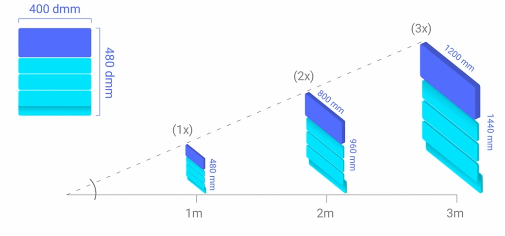
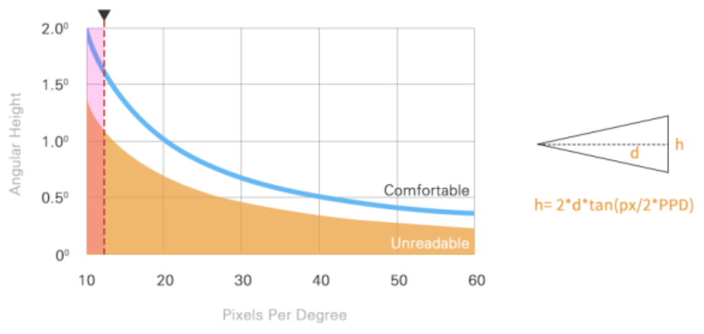
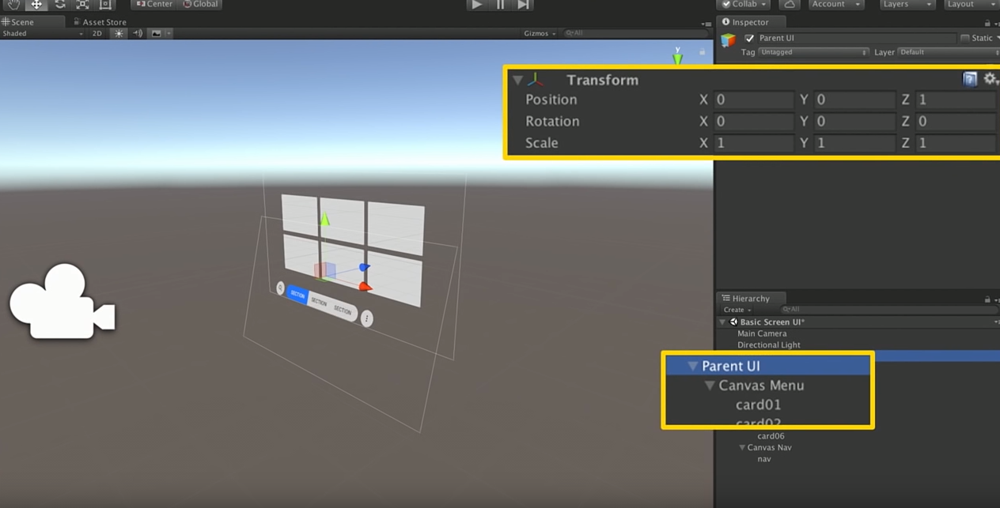
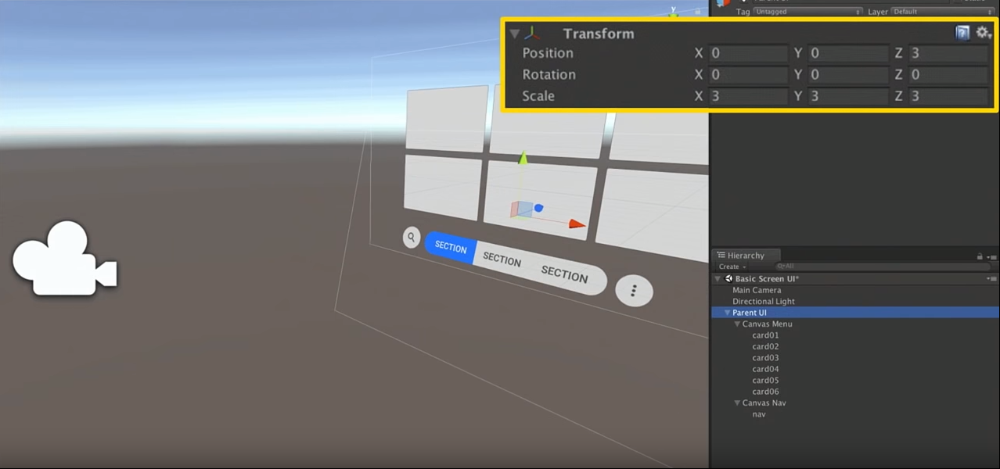
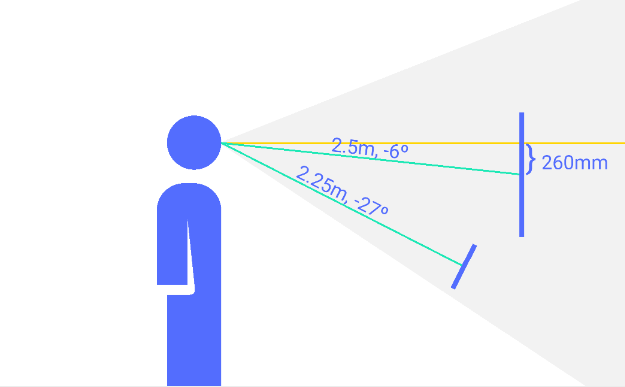
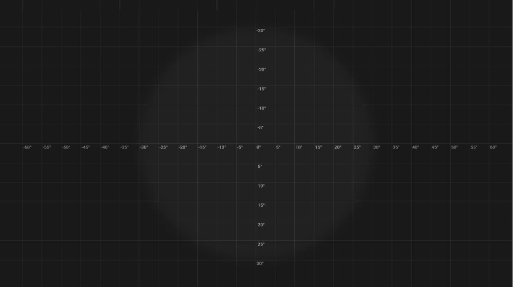


Google I/O 2017，DayDream团队提出的UI设计规范。


<!--more-->

# dmm概念

在VR的设计中，UI物体会因为距离用户的远近距离不同导致视觉上大小的变化。对于设计师而言，他们只能针对2D画面进行设计，而无法给出UI距离用户的距离，所以在游戏引擎中很难将UI调至设计师希望的样子。

我们可以用角度来解决这个问题，不同距离不同大小的物体，只要他们在视线内所占的角度是相同的，那么对于人眼来说，他们看起来就是相同的大小。如下图所示：

上图左上角的`dmm`单位就是DayDream团队提出的用以解决这问题的单位，`dmm`(distance-independent millimeter，距离不相关毫米)，我们将1米外看起来长为1毫米的长度定义为1dmm，按定义可知2m外看起来为2mm的长度也为1dmm。在2D设计软件中，我们将软件中的1px看作为1mm。这样当设计师给出一张480*320像素的图片，这张图的含义即为在1米外看起来长480毫米，高320毫米的图片。

# 文字最小尺寸

一个文字看的是否清楚取决于用了多少像素的去渲染这个文字。在这里首先解释下`PPD`（Pixel Per Degree）的概念，在VR设备中我们用一块屏幕来显示一定宽度视场角的内容，如HTV Vive的双眼分辨率为2160\*1200，单眼分辨率为1080\*1200，视场角为110°，则HTV vive的PPD为`1080/110`约为9.8即1°的画面平均含有9.8个像素。在PPD越低的设备上，我们要保证一个文字足够清晰就需要扩大文字在设备中所占的角度来确保它有足够的像素。DayDream团队给出的文字所占角度与设备PPD关系的图如下：

以设备PPD为12.6进行计算， 则文字需要有1.6°的高度，也就是文字需要有12.6\*1.6=20.16个屏幕上的像素进行渲染。如果使用dmm而非像素来进行统计的话，可以使用公式 $2\tan(\frac{angle}{2})\*1000$ 来进行计算。如这里需要角度为1.6°，则结果为 $2\tan(\frac{1.6}{2})\*1000=27.9$ dmm，即在2D设计软件中需要用28个像素来表示，也就是28号字体，对于3D场景来说则是28毫米。

# Unity中使用


Unity中Scale为1表示为1米


建立一个Demo场景，首先存在根物体`ParentUI`，Z轴值为1，表示距离我们1米远，Scale为1

在`ParentUI`下有个带有`Canvas`组件的物体`Canvas Menu`,它的Scale为0.001，这是因为在dmm概念中所有的计算单位都是毫米，所以我们需要将米转换为毫米。

这样在`Canvas Menu`下的所有UI组件都可以按设计图给的尺寸调整大小，如一张图片大小为400*320，在Unity中我们就将其Width,Height设为400,320。

当我们需要将UI放的更远，而保持UI大小不变的话，整体调整`ParentUI`的Scale即可，如

# 其他

1. UI的中心水平应该在水平线下6°左右
   
    

2. 人保持头不动时，理想的视线范围是左右30°以内，带上颈部旋转的话，理性范围是左右60°以内
   
   


引用：
1. [Google I/O 视频](https://www.youtube.com/watch?v=ES9jArHRFHQ)
2. [Google Design Sticker Sheet](https://developers.google.com/vr/design/sticker-sheet)
3. [如何 VR 界面设计规范与实操](https://www.jianshu.com/p/c21addac9b0e)


***